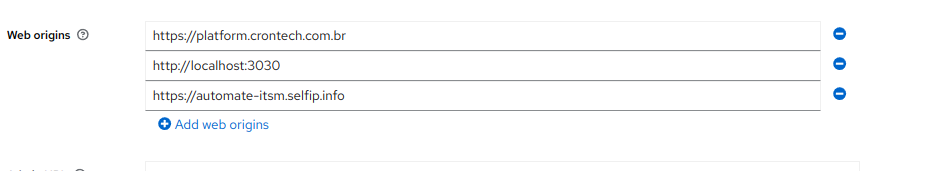
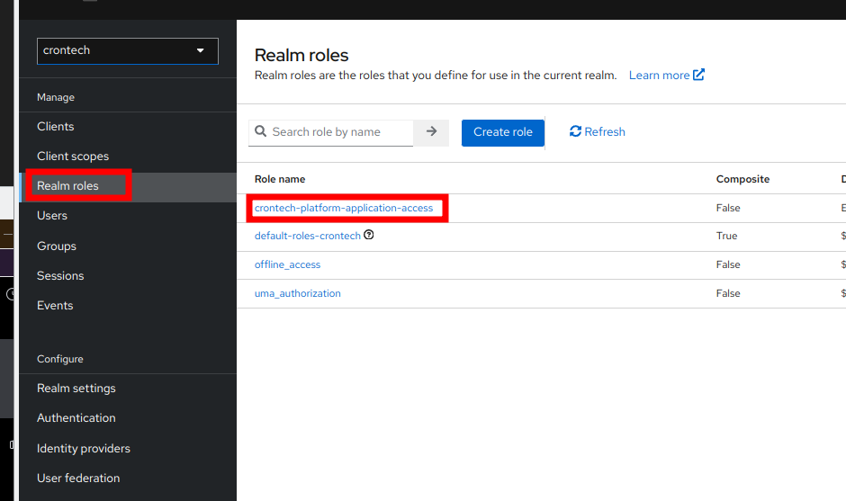
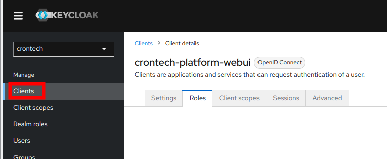

## Configurando o Keycloak corretamente

Primeiramente você precisa criar um novo Realm e um novo client no keycloak com:

```
  "client Authentication" = Off (Modo público)
```

Pois o painel administrativo é um frontend publico, ou seja pode ser modificado e portanto não é confiável.

Depois você precisa habilitar o "authentication flow" "Standard Flow" e "Direct Access Grants".

E adicionar em Web Origins o endereço do seu painel administrativo, por exemplo:

```
  "http://localhost:3030"
```

Em produção você deve adicionar endereço de cada dominio usado:

Por exemplo:



**Nota:** **Standard flow** permite a configuração de cors e **Direct Access Grants** permite a autenticação via usuário
e senha.

Com isso você já consegue se autenticar, só precisa do username, password e o client_id.

Exemplo de teste:

```http request
### Login keycloak

POST https://auth.crontech.com.br/realms/crontech/protocol/openid-connect/token
Content-Type: application/x-www-form-urlencoded

username = andre &
password = abc123 &
client_id = crontech-platform-webui &
grant_type = password

###
```

### Autenticação baseada em roles.

Como o keycloak é um sistema de autenticação centralizado, o mesmo usuário pode utilizar a mesma conta para acessar
diferentes sistemas. Por isso é interessante criar uma regra de acesso inicial para cada aplicação, com isso usuário
ativo em uma aplicação não necessariamente terá acesso a outra.

Você pode definir roles para cada cliente ou a nível de realm e autenticar usuários apenas que tenho essas roles.

Recomendação de como fazer isso:

```dotenv
NUXT_PUBLIC_ADMIN_AUTH_ROLE_ENABLED=true
NUXT_PUBLIC_ADMIN_AUTH_ROLE_PATH=realm_access.roles
NUXT_PUBLIC_ADMIN_AUTH_ROLE_ROLES=crontech-platform-application-access
```

**AUTH_ROLE_PATH:** Localização da role dentro do keycloak, este é o caminho para roles de realm.
**AUTH_ROLE_ROLES:** Nome da role que o usuário deve possuir para acessar o painel administrativo.






