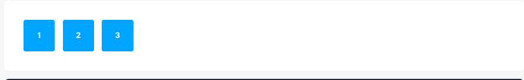
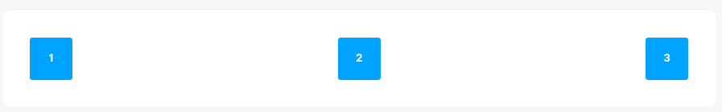

# Guia de Montagem de Página

Este guia ajuda a escolher o melhor caminho para desenhar seu novo layout, seu novo componente, qual css utilizar, qual
framework utilizar.

Este layer carrega 2 framework principais que são subdividido Prime e AdminLte:

| Framework   | Descrição                                                                                                                                                                                                                                                                                                                                                              |
|-------------|------------------------------------------------------------------------------------------------------------------------------------------------------------------------------------------------------------------------------------------------------------------------------------------------------------------------------------------------------------------------|
| `Prime`     | Framework  inicialmente criado em Java, mas com uma versão para VUE                                                                                                                                                                                                                                                                                                    |
| `PrimeVue`  | Coleção de componentes prontos Vue, compátivel com Vue3 e Nuxt3. Define poucos estilos, é possivel adapta-lo para diferentes framework CSS, como Bootstrap, Tailwind entr outros. Categorias de componentes disponiveis:<br/>`Formulário`, `Botões`, `Listagem de dados`, `Paineis`, `Overlay`, `Gráficos`, `Mensagens`, `Media` entre outros                          |
| `PrimeFlex` | PrimeFlex é uma biblioteca de utilitários CSS que apresenta vários auxiliares, como sistema de grade, flexbox, espaçamento, elevação e muito mais.                                                                                                                                                                                                                     |
| `AdminLte`  | Template pronto gratuito baseado em Bootstrap, que disponibiliza tanto utilitaários CSS quanto componentes javascript.<br/> Os componentes em javascript não podem ser utilizado diretamente pois conflita com vue, já que utiliza bibliotecas antigas como o Jquery, nessário adaptar e criar novos componentes.<br/> https://adminlte.io/docs/3.1//dependencies.html |
| `Bootstrap` | Como o adminLTE vem integrado com o AdminLTE, o Bootstrap também está disponível para uso na versão 4.6 (Incluido do adminLTE 3.1)                                                                                                                                                                                                                                     |

**Notas**

* Priorizar o primeVue e primeFlex e utilizar o AdminLTe para extrair elementos visuais
  * PrimeVue: Utilizar para aproveitar componentes prontos
  * PrimeFlex: Estruturação do Layout
  * Admin: Elementos visuais, estilo
* Classes disponibilizadas pelo PrimeVue: https://primevue.org/theming/#utils
* Cores disponitilizadas pelo PrimeVue: https://primevue.org/colors/
* Icones: https://primevue.org/icons/

# Tailwind vs Bootstrap
Ref: https://www.alura.com.br/artigos/tailwind-framework-bootstrap-tailwind

No geral depende do caso de uso, assim como qualquer outra ferramenta ou framework. Para quem está começando Bootstrap é
mais simples de escrever (por conta do uso do padrão BEM) e criar layouts, mas com o custo de ter que usar o UI kit
padrão (tornando seus projetos mais genéricos em linguagem visual) e ter que usar várias ferramentas extras para o
funcionamento de alguns componentes, como JQuery, tornando a solução mais "lotada" e mais pesada.

Tailwind permite maior controle na linguagem visual e é a solução mais leve por usar apenas as classes necessárias para
desenvolver a página. Caso precise de outras ferramentas e plugins, você pode instalar por opção e não obrigação. Por
outro lado, ele requer um conhecimento maior das propriedades CSS e seus nomes de classes exigem uma curva de
aprendizado maior comparado com Bootstrap.

Gostou do conteúdo e quer aprender mais sobre CSS? Então conheça a Formação HTML e CSS da Alura e mergulhe nos mares do
front-end!

# 01 - Layout

* Ler: https://primeflex.org/installation
* FLEXBOX: https://primeflex.org/flexdirection
* GRID SYSTEM: https://primeflex.org/gridsystem

TODO: Verificar uso atual, e tentar padronizar no PrimeFlex, pois o adminLte pode ser custimizado no futuro

# 02 - Alinhamento de elementos ex: Divs

REF: https://primeflex.org/justifycontent

Distribui a div igualmente

```html

<div class="flex justify-content-between ">
  <div>
    Orçamento do Fulano de tal
  </div>
  <div>
    Texto no meio
  </div>
  <div>
    Orçamento do Fulano de tal
  </div>
</div>
```

### justify-content-start



### justify-content-end

### justify-content-center

### justify-content-between



### justify-content-around

### justify-content-evenly

# 03 - Alinhamento de Texto

# 04 - Cores

* Temos o padrão bootstrap https://getbootstrap.com/docs/4.0/utilities/colors/
* Temos o padrão primevue https://primeflex.org/textcolor

* Ambos usam Conjunto diferente de classes, primeflex é mais aberto, enquanto o bootstrap é mais pré definido
* Bootstrap fornece
  .text-primary .text-secondary .text-success .text-danger .text-warning .text-info .text-light .text-dark .text-muted
  .text-white

* PrimeFlex fornece uma gama muito maior de opções e variações
  * https://primevue.org/colors/
  * https://primevue.org/colors/

# 05 - Tipografia

[Tipografia](text.md)
