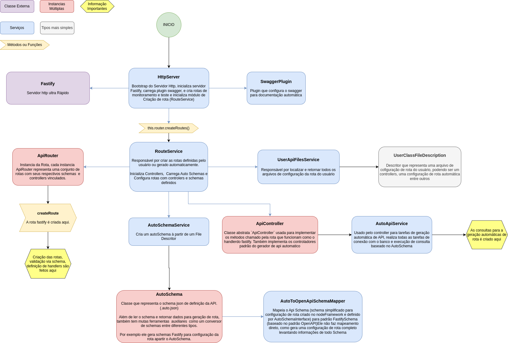

# Arquitetura

## Sobre a documentação

- Por ser um módulo complexo, revise a documentação de periodicamente, adicionando mais informação e principalmente
  verificando se a documentação está clara, melhorando-a.

## Diagrama

Source: https://drive.google.com/file/d/1GSaHr2BnL7aYExdjkP4sU_akuDpQ956C/view?usp=sharing

## Ciclo de vida da aplicação

* Server **(library/server.mjs)**
  * Se httpServer2.enabled estiver habilitado chama o httpServer.run
* HttpServer **(library/http/httpServer.ts)**
  * Configura e inicializa o servidor Fastify
  * Chama o RouterService para inicializar as rotas do usuário **(library/http/services/routeService.ts)**
    * router.createRoutes
* Utilizando a classe **userAPiFilesService** carrega todas os arquivos criados pelo usuário para implementar sua API **(
  library/http/services/userApiFilesService.ts)**
* Valida configuração dos usuário
* importa, instancia e inicializa todos os componentes usados para definir a api do usuário:
  * Carrega todos os AutoSchema (.auto.json) (configuração schema em json usada pra definir a rota do usuário) ()
  * Carrega todos os controllers (.controller.ts) ou gera automaticamente
  * Carrega e configura Rotas (.routes.ts) ou gera automaticamente
  * Inicializa ROTAS

## Ciclo de vida da Requisição

*

## Descriptor

- SCHEMA MAPPER

  - O Schema do fastfy é complexo, vamos criar o nosso e
    mapear (https://fastify.dev/docs/latest/Reference/Validation-and-Serialization/
  - Em casos avançasdos podemos usar o original

- TRATAMENTO DE ERRO (ERROR HANDLER)

  - Error Handling (https://fastify.dev/docs/latest/Reference/Validation-and-Serialization/#error-handling)
  - Acompanhar testes desde o inicio e documentar padrão de erros semantico

- CONFIGURAÇÂO

  - Configuração central do servidor como cors entre ouros

- MIDLEWARE
  - para definir autenticação pro exemplo ou
  - prefixo de rota para versão api/v1
